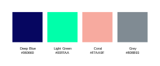

# Fieldcraft logo

SVG logomark, logotype and favicon. Used for ownCloud and ResourceSpace branding.

Logos created in [Inkscape](https://inkscape.org), the open source SVG editor of choice.

## Colour

```
Deep Blue #060660
Light Green #00FFAA
Coral #F7AA9F
Grey #808B93
Black #000000
White #FFFFFF
```



## ownCloud theming

There is a Fieldcraft theme for ownCloud, called `theme-fieldcloud`, which is here <https://github.com/fieldcraft-studios/theme-fieldcloud>.

It is based on [ownCloud’s example theme](https://github.com/owncloud/theme-example), with images and colours replaced. For more information on ownCloud theming, <https://doc.owncloud.com/server/developer_manual/core/theming.html>

The theme should be placed in the `apps` directory. From the command line, `cd` into the directory:  
`/share/CACHEDEV2_DATA/home/owncloud/volumes/files/apps`

Then, `wget` the theme [zip file](`/share/CACHEDEV2_DATA/home/owncloud/volumes/files/apps`, `unzip` it, rename it `theme-fieldcloud` and run `chmod 755 -R theme-fieldcloud` to make sure it's recognised.

The theme is activated from ownCloud `Settings > Admin > Apps`. Make sure to click `Show disabled apps` to be able to see it.

I was unable to get the theme to work from a [custom app directory](https://doc.owncloud.com/server/admin_manual/installation/apps_management_installation.html#using-custom-app-directories). 

## ResourceSpace branding

There’s no theme for ResourceSpace, the images and colours are applied via the `System > System Configuration`. Documents for this are available at <https://www.resourcespace.com/knowledge-base/systemadmin/>

* Font: Roboto
* Application logo: `fieldcraft-resourcespace-application-logo.svg`
* Application favicon: `output > favicon > favicon.svg`
* Custom header background colour: `Deep Blue #060660`
* Custom intro text, dash tile and simple search colour: `Grey translucent rgba(104, 120, 132, 0.9)`
* Custom collection bar primary colour: `Grey translucent rgba(104, 120, 132, 0.9)`
* Custom collection bar secondary colour:  `Unofficial grey #676767`

Customising the home page slideshow: images can be selected via `Admin > System > Manage Slideshow`.
